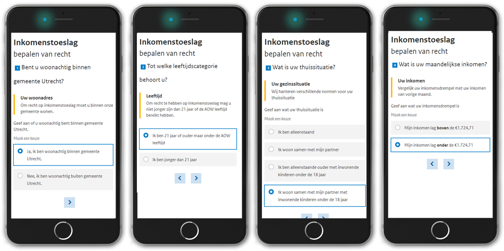
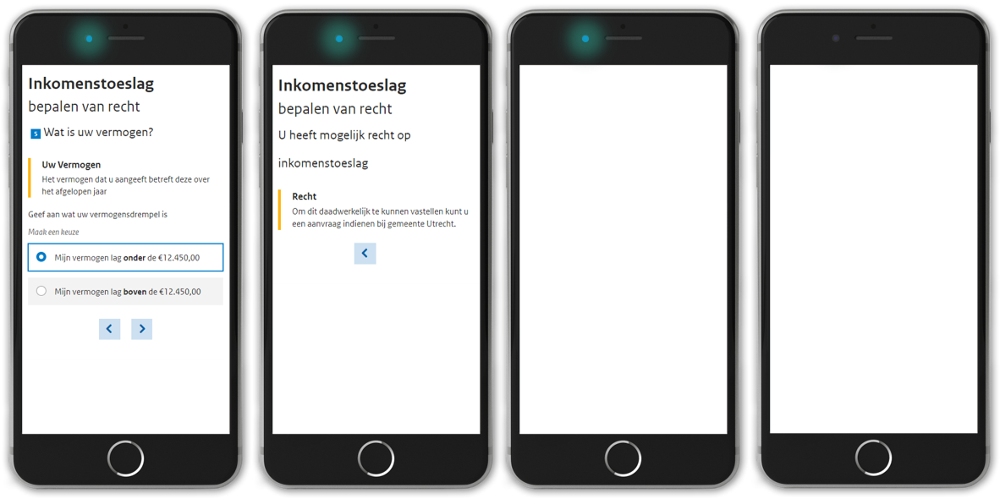

# inkomenstoeslag

# Spoor 1 POC Utrecht

### Experiment I
Versimpelde aanvraag vanuit beleid en voor de doelgroep

* IIT regel is versimpeld voor makkelijke aanvraag
* Standaard gegevensdefinitie IIT (GBI en Financieel Paspoort)
* Max 4 simpele vragen zijn opgesteld die een eerste indicatie geven op het recht en de hoogte van de IIT
* Validatie bij de doelgroep leidt tot een uitgewerkt UX design (t/m opgehaalde data)

**Let op** Hoogte toeslag niet berekend, niet gespecificeerd in de IIT




Open Live demo formulier rechtbepaling op de [Inkomenstoeslag](https://digital-me.azurewebsites.net/proefberekening/?rules=https%3a%2f%2fraw.githubusercontent.com%2fsjefvanleeuwen%2finkomenstoeslag%2fmain%2fconfiguration%2finkomenstoeslag.yaml&content=https%3a%2f%2fraw.githubusercontent.com%2fsjefvanleeuwen%2finkomenstoeslag%2fmain%2fconfiguration%2finkomenstoeslag.content.yaml)

Yaml Gemodeleerd naar IIT:  https://gitlab.com/commonground/virtueel-inkomstenloket/poc_utrecht_iit/-/tree/experiment_I/BPMN

#### Formulier configuratie (semantisch):

```YAML
# Individuele inkomenstoeslag POC
stuurinformatie:
  onderwerp: individuele inkomenstoelag
  organisatie: Gemeente Utrecht
  type: toeslagen
  domein: inkomen
  versie: 0.1
  status: ontwikkel
  jaar: 2020
  bron: https://gitlab.com/commonground/virtueel-inkomstenloket/poc_utrecht_iit/-/blob/experiment_I/BPMN/BPMN%20Virtueel%20Inkomens%20Loket%20-%20IIT%2019-11-2020.bpmn
berekening:
  - stap: woonadres
    keuze:
    - situatie: woonadres_utrecht
    - situatie: woonadres_anders
    recht: woonadres_utrecht
  - stap: leeftijd
    keuze:
    - situatie: ouder_dan_21
    - situatie: jonger_dan_21
    recht: ouder_dan_21
  - stap: gezinssituatie
    keuze: 
    - situatie: alleenstaand
    - situatie: partner
    - situatie: alleenstaand_kinderen_jonger_dan_18
    - situatie: partner_kinderen_jonger_dan_18
  - stap: inkomen
    keuze:
    - situatie: hoger_dan_inkomensdrempel
    - situatie: lager_dan_inkomensdrempel
    recht: lager_dan_inkomensdrempel
  - stap: vermogen
    keuze:
    - situatie: lager_dan_vermogensdrempel
    - situatie: hoger_dan_vermogensdrempel
    recht: lager_dan_vermogensdrempel
  - stap: end
formules:
 - inkomensdrempel:
   - situatie: alleenstaand
     formule: 1207.30
   - situatie: alleenstaand_kinderen_jonger_dan_18
     formule: 1207.30
   - situatie: partner
     formule: 1724.71
   - situatie: partner_kinderen_jonger_dan_18
     formule: 1724.71
 - vermogensdrempel:
   - situatie: alleenstaand
     formule: 6225
   - situatie: alleenstaand_kinderen_jonger_dan_18
     formule: 6225
   - situatie: partner
     formule: 12450
   - situatie: partner_kinderen_jonger_dan_18
     formule: 12450
```

#### CMS Content:

```YAML
Content:
 - key: berekening.header
   titel: Inkomenstoeslag 
   ondertitel: bepalen van recht
 - key: stap.woonadres
   titel: Uw woonadres
   vraag: Bent u woonachtig binnen gemeente Utrecht?
   tekst: Om recht op inkomenstoeslag moet u binnen onze gemeente wonen.
 - key: stap.woonadres.keuze.woonadres_utrecht
   label: Geef aan of u woonachtig bent binnen gemeente Utrecht.
   hint: Maak een keuze
   tekst: Ja, ik ben woonachtig binnen gemeente Utrecht.
 - key: stap.woonadres.keuze.woonadres_anders
   tekst: Nee, ik ben woonachtig buiten gemeente Utrecht.
 - key: stap.woonadres.geen_recht
   vraag: Geen Recht
   titel: U heeft geen recht
   tekst: U Bent niet woonachtig binnen Utrecht. Ga naar uw eigen gemeentelijke voorziening.
 - key: stap.leeftijd
   titel: Leeftijd
   vraag: Tot welke leeftijdscategorie behoort u?
   tekst: Om recht te hebben op inkomenstoeslag mag u niet jonger zijn dan 21 jaar of de AOW leeftijd bereikt hebben.
 - key: stap.leeftijd.keuze.jonger_dan_21
   label: Uw leeftijdscategorie
   hint: Maak een keuze
   tekst: Ik ben jonger dan 21 jaar
 - key: stap.leeftijd.keuze.ouder_dan_21
   tekst: Ik ben 21 jaar of ouder maar onder de AOW leeftijd
 - key: stap.leeftijd.geen_recht
   vraag: Geen Recht
   titel: U heeft geen recht
   tekst: U dient ouder te zijn dan 21 jaar en niet de AOW leeftijd bereikt hebben.
 - key: stap.gezinssituatie
   titel: Uw gezinssituatie
   vraag: Wat is uw thuissituatie?
   tekst: Wij hanteren verschillende normen voor uw thuissituatie
 - key: stap.gezinssituatie.keuze.alleenstaand
   label: Geef aan wat uw thuissituatie is
   hint: Maak een keuze
   tekst: Ik ben alleenstaand
 - key: stap.gezinssituatie.keuze.partner
   tekst: Ik woon samen met mijn partner
 - key: stap.gezinssituatie.keuze.alleenstaand_kinderen_jonger_dan_18
   tekst: Ik ben alleenstaande ouder met inwonende kinderen onder de 18 jaar
 - key: stap.gezinssituatie.keuze.partner_kinderen_jonger_dan_18
   tekst: Ik woon samen met mijn partner met inwonende kinderen onder de 18 jaar
 - key: stap.inkomen
   titel: Uw inkomen
   vraag: Wat is uw maandelijkse inkomen?
   tekst: Vergelijk uw inkomensdrempel met uw inkomen van vorige maand.
 - key: stap.inkomen.keuze.hoger_dan_inkomensdrempel
   label: Geef aan wat uw inkomensdrempel is
   hint: Maak een keuze
   tekst: Mijn inkomen lag **boven** de &euro;{{inkomensdrempel | string.to_double | math.format "N" "nl-NL"}}
 - key: stap.inkomen.keuze.lager_dan_inkomensdrempel
   tekst: Mijn inkomen lag **onder** de &euro;{{inkomensdrempel | string.to_double | math.format "N" "nl-NL"}}
 - key: stap.inkomen.geen_recht
   vraag: Geen Recht
   titel: U heeft geen recht
   tekst: Uw inkomen ligt **boven** de €{{inkomensdrempel | string.to_double | math.format "N" "nl-NL"}}
 - key: stap.vermogen
   titel: Uw Vermogen
   vraag: Wat is uw vermogen?
   tekst: Het vermogen dat u aangeeft betreft deze over het afgelopen jaar
 - key: stap.vermogen.keuze.lager_dan_vermogensdrempel
   label: Geef aan wat uw vermogensdrempel is
   hint: Maak een keuze
   tekst: Mijn vermogen lag **onder** de &euro;{{vermogensdrempel | string.to_double | math.format "N" "nl-NL"}}
 - key: stap.vermogen.keuze.hoger_dan_vermogensdrempel
   tekst: Mijn vermogen lag **boven** de  &euro;{{vermogensdrempel | string.to_double | math.format "N" "nl-NL"}}
 - key: stap.vermogen.geen_recht
   vraag: Geen Recht
   titel: U heeft geen recht
   tekst: Uw vermogen ligt **boven** de  &euro;{{vermogensdrempel | string.to_double | math.format "N" "nl-NL"}}
 - key: stap.end
   titel: Recht
   vraag: U heeft mogelijk recht op inkomenstoeslag
   tekst: Om dit daadwerkelijk te kunnen vastellen kunt u een aanvraag indienen bij gemeente Utrecht.
   label: geef een label voor het invoerveld.
   hint: geef een hint voor het invoerveld.

```